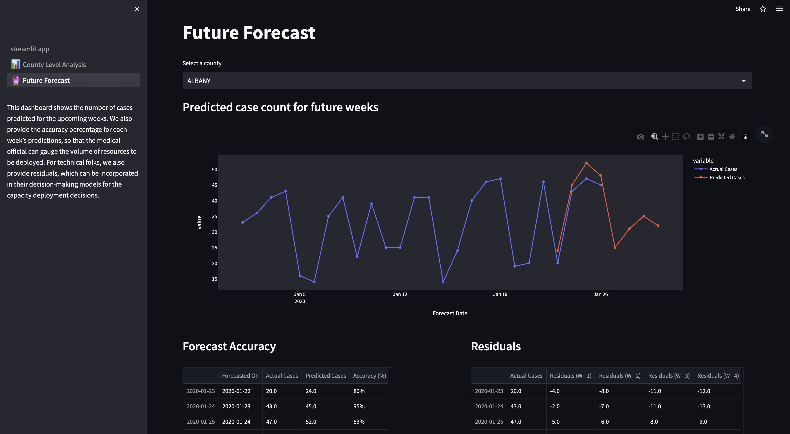

## Predictive Analytics on Spread of Influenza
**Bryce Whitney, Neha Barde, Shen Juin Lee, Shrey Gupta**

## Influenza Forecast Engine
A streamlit based web application which gives you 4 week ahead forecast of influenza cases in the state of New York at a county level.
>

&nbsp;
## Running the Code

**1. Clone the repository**
```
https://github.com/guptashrey/spread-of-airborne-diseases
```
**2. Switch to the 'st' branch**
```
git checkout st
```
**3. Create a conda environment:** 
```
conda create --name environ python=3.8
```
**4. Install requirements:** 
```
pip install -r requirements.txt
```
**5. Run the application**
```
streamlit run streamlit_app.py
```
